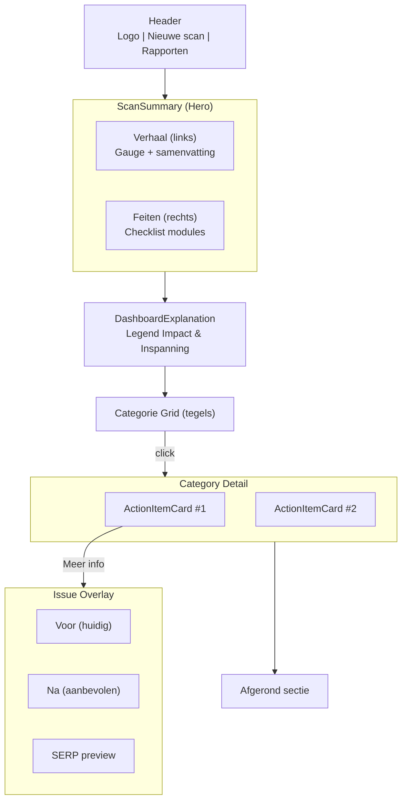

# Plan: Verbetering UX Scanresultaten Pagina

Dit document beschrijft het plan om de gebruikerservaring (UX) van de AIO Scanner resultatenpagina te verbeteren. Het doel is om van een technische datadump naar een persoonlijk, inzichtelijk en actiegericht adviesrapport te gaan.

## 1. Visie: De Resultatenpagina als Persoonlijke Adviseur

De nieuwe resultatenpagina moet aanvoelen als een gesprek met een deskundige adviseur. De pagina moet de gebruiker direct het gevoel geven dat we zijn of haar website begrijpen en concrete, geprioriteerde handvatten bieden voor verbetering.

We stappen af van het presenteren van ruwe data en gaan over op het uitleggen van de **relevantie**, **impact** en **benodigde inspanning** van elk gevonden punt.

## 2. Implementatieplan

### Fase 1: De Samenvatting & Onboarding

Dit is het eerste wat de gebruiker ziet. Het doel is om binnen 30 seconden context en een top-level oordeel te geven.

**Component: `ScanSummary`**

*   **Layout:** Een tweekoloms-sectie bovenaan de pagina.
*   **Linkerkolom (Het Verhaal):**
    *   **Titel:** `Jouw AIO Scanrapport voor [website.url]`
    *   **Hoofdscore:** Een grote, visuele "Online Aanwezigheid Score" (bv. 78/100) in een cirkeldiagram (gauge).
    *   **AI-gegenereerde Samenvatting:** Een paragraaf die de volgende vragen beantwoordt:
        *   Wat voor soort website is dit? (bv. "Onze AI ziet dat dit een website is voor een lokale bakkerij.")
        *   Wat is de algemene conclusie? (bv. "De technische basis is solide...")
        *   Waar ligt de grootste kans? (bv. "...maar de grootste groei ligt in het verbeteren van de lokale vindbaarheid.")
*   **Rechterkolom (De Feiten):**
    *   **Titel:** `Scan Overzicht`
    *   **Checklist "Wat hebben we geanalyseerd?":** Een simpele lijst met de uitgevoerde scanmodules (Technische SEO, AI Content, Schema, etc.) om de scope en waarde van de scan te tonen.

### Fase 2: Uitleg van het Dashboard

Direct onder de samenvatting komt een korte sectie die de gebruiker uitlegt hoe de rest van de pagina werkt.

**Component: `DashboardExplanation`**

*   **Titel:** `Jouw Gepersonaliseerde Actieplan`
*   **Inhoud:** Een korte tekst die de concepten introduceert:
    *   **Impact:** "We laten zien hoeveel impact een verbetering heeft op je online succes."
    *   **Inspanning:** "We schatten in hoe makkelijk het is om op te lossen. Een **Quick Win** kun je vaak zelf snel aanpassen."

### Fase 3: Het Geprioriteerde Actieplan

Dit is de kern van de pagina. We vervangen de huidige lijst met een systeem van "actiekaarten".

**Component: `ActionItemCard`**

Elk gevonden verbeterpunt wordt een kaart met de volgende elementen:

1.  **Titel:** Duidelijke, beknopte omschrijving van het probleem (bv. "De `<h1>` hoofdtitel ontbreekt op de homepage.").
2.  **Labels:**
    *   **Impact:** `HOOG`, `GEMIDDELD`, `LAAG` (met een `ℹ️` tooltip die uitlegt waarom).
    *   **Inspanning:** `QUICK WIN`, `GEMIDDELD`, `HOGE INSPANNING` (met een `ℹ️` tooltip die uitlegt wat dit inhoudt).
3.  **Sectie: "Waarom is dit een probleem?"**
    *   Een door AI verrijkte, in duidelijke taal geschreven uitleg over de *gevolgen* van het probleem voor de website-eigenaar. Focus op resultaten (klanten, ranking, vertrouwen).
4.  **Sectie: "Hoe los je het op?"**
    *   Een concreet, stapsgewijs advies. Maak het zo praktisch mogelijk (bv. "Log in op WordPress > Ga naar Pagina > Pas de titel aan en zorg dat deze is ingesteld als 'Heading 1'.").

**Component: `ActionList`**

*   De container voor de `ActionItemCard`s.
*   **Functionaliteit:**
    *   Standaard gesorteerd op **Impact** (hoog naar laag).
    *   Filters bovenaan:
        *   Filter op Categorie (Technische SEO, Content, etc.).
        *   Filter op Impact.
        *   Filter op Inspanning.

## 3. Technische Overwegingen

*   **AI-integratie:** De AI-gegenereerde samenvatting en de "Waarom is dit een probleem?"-teksten moeten worden ontwikkeld. Dit vereist nieuwe prompts en integratie in de `PostScanProcessorService`.
*   **Prioritering Logica:** We moeten een intern model ontwikkelen om `Impact` en `Inspanning` te bepalen voor elk patroon dat we detecteren in `patterns/*.json`. Dit kan een simpele mapping zijn in de configuratie van elke module.
*   **UI Componenten:** De nieuwe Svelte-componenten (`ScanSummary`, `DashboardExplanation`, `ActionItemCard`, `ActionList`) moeten worden gebouwd in `src/lib/components/features/scan-results/`.

## 4. Klantgesprekken, Bevindingen & Acties (log)

> Dit logboek houdt kort en bondig bij welke input we van klanten/gebruikers hebben gekregen, wat daaruit is geleerd en welke concrete acties zijn opgepakt. Nieuwe gesprekken steeds onderaan toevoegen (omgekeerd chronologisch).

### 2025-07-11 – Feedback demo huidige Results Page

**Deelnemers**  
– Klant (MKB-eigenaar)  
– UX-er (facilitator)  
– Dev-lead (notulist)

**Bevindingen**  
1. Onafgebroken lijst met issues voelde "overweldigend"; klant miste snel overzicht.  
2. Wens voor vaste, herkenbare hoofd-categorieën om eerst te zien "waar de problemen zitten".  
3. Na doorklik graag een helder voorbeeld met *voor*- en *na*-tekst/code.  
4. Positief over kleuren-badges (Impact/Inspanning) → graag behouden.  
5. Downloadbare PDF werd als belangrijke feature genoemd om intern te delen.

**Acties**  
- [x] Ontwerpen van *Categorie-tegels* (Technische SEO, Content, Schema, Core Web Vitals, …).  
- [x] Definiëren drill-down flow: tegel → issues in categorie → detail overlay.  
- [x] Voorzien in "Voor/Na"-blok met kopieerknop en SERP-preview.  
- [ ] PDF-export stylen in zelfde kleuren & iconen (opgenomen in sprint #14).

---

## 5. Voorbeeld-layout & Interactie

Onderstaande wireframes tonen hoe de vernieuwde Results Page zich gedraagt op desktop (≥ 1024 px) en mobiel (≤ 768 px). Gebruik dit als referentie bij ontwerp en implementatie.

### 5.1 Desktop – Hoofdoverzicht (Categorie-tegels)

```text
┌──────────────────────────────────────────────────────────────┐
│  Jouw AIO-scanrapport voor example.com         78/100  🟢   │
│  "Samenvatting in gewone mensentaal…"                       │
├──────────────────────────────────────────────────────────────┤
│  Techniek   Content   Schema   Core Web Vitals   Security    │
│  🔧 3 ⚠️     ✍️ 2 ⚠️     🗺️ 1 ⚠️     🚀 0 ⚠️           🔒 1 ⚠️  │
└──────────────────────────────────────────────────────────────┘
```

Interactie:
1. Klik op een tegel → zachte **scale-up** animatie, routering naar `/results/:category`.
2. Hover toont progress-ring + tooltip "60 % opgelost".

### 5.2 Desktop – Issues binnen Categorie

```text
← Terug | Technische SEO (3 issues)  | Filter:  Impact ▾  Inspanning ▾

┌─────────────── ActionItemCard ───────────────┐
│  [HOOG] [QUICK WIN] H1 ontbreekt op homepage │
│  ▸ Waarom is dit een probleem?               │
│  ▸ Hoe los je het op?                        │
└──────────────────────────────────────────────┘
┌─────────────── ActionItemCard ───────────────┐
│  [GEMIDDELD] [GEMIDDELD] Broken links        │
│  …                                           │
```

Interactie:
* Accordion-pijltje ▸ klapt body open (200 ms ease-out).
* Checkbox "Markeer als opgelost" verschuift kaart naar onderste sectie "Afgerond".
* Sticky FAB rechtsonder: Download PDF.

### 5.3 Issue-overlay (Voor/Ná & Preview)

```text
┌──────────────────────────────────────────────┐
│ ✖  H1 ontbreekt op homepage                 │
│──────────────────────────────────────────────│
│ Huidige situatie            | Aanbevolen    │
│ <h2>Welkom</h2>             | <h1>Welkom</h1>│
│──────────────────────────────────────────────│
│ Google-snippet preview                        │
│  Welkom – Bakkerij de Krent…                 │
│──────────────────────────────────────────────│
│  ✔️ Markeer als opgelost    |  Kopieer code  │
└──────────────────────────────────────────────┘
```

### 5.4 Mobiel

* Samenvatting en tegels worden **gestapeld**; tegels in twee-koloms grid.  
* Categorie-nav in een horizontale **scrollbar** onder de samenvatting.  
* Overlays gebruiken volledige viewport; sluit met swipe-down of ✖.

### 5.5 Toegankelijkheid

* Alle interactieve elementen krijgen `:focus-visible` outline.  
* Tegels en kaarten hebben `role="button"` + `aria-pressed` voor opgelost status.  
* Esc sluit overlays; ← sluit categorieview; deep-links `/results#content/h1-missing` brengen direct naar overlay.

---

## 6. Mock Wireframe (Mermaid)

Gebruik onderstaand diagram om de hiërarchie en navigatie snel te begrijpen. Bij SvelteKit kan de Mermaid-rendering lokaal bekeken worden met een VS Code plugin of via mermaid.live.


