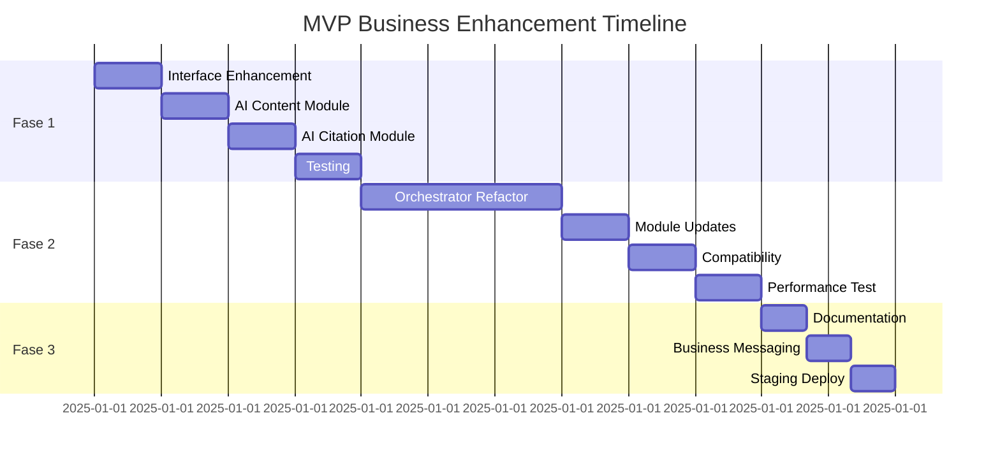

# MVP Business Enhancement Plan

**Status:** Ready for Implementation  
**Timeline:** 3 dagen (6 uur development)  
**Philosophy:** Laaghangende vruchten, maximale impact, minimale complexiteit

---

## 📊 STATUSOVERZICHT & GEFASEERD PLAN

### **Overzicht Projectstatus**
| Component | Status | Start Datum | Eind Datum | Geschatte Tijd | Verantwoordelijke |
|-----------|--------|-------------|------------|----------------|-------------------|
| **FASE 1: Foundation** | ⏳ Planned | - | - | 2 uur | - |
| **FASE 2: Performance** | ⏳ Planned | - | - | 3 uur | - |
| **FASE 3: Deployment** | ⏳ Planned | - | - | 1 uur | - |
| **TOTAAL PROJECT** | ⏳ Planned | - | - | 6 uur | - |

**Status Legenda:**
- ⏳ Planned (Gepland)
- 🚧 In Progress (In Uitvoering)  
- ✅ Completed (Voltooid)
- ❌ Blocked (Geblokkeerd)
- ⚠️ Delayed (Vertraagd)

### **FASE 1: FOUNDATION SETUP** ⏳
**Doel:** Basis infrastructuur voor metrics en enhanced findings  
**Tijd:** 2 uur  
**Afhankelijkheden:** Geen

| Taak | Status | Geschatte Tijd | Beschrijving |
|------|--------|----------------|--------------|
| 1.1 Finding Interface Enhancement | ⏳ | 30 min | `metrics` field toevoegen aan Finding interface |
| 1.2 AIContentModule Enhancement | ⏳ | 30 min | Conversational score preservation implementeren |
| 1.3 AICitationModule Enhancement | ⏳ | 30 min | Authority score aggregation toevoegen |
| 1.4 Testing & Validation | ⏳ | 30 min | Validatie van enhanced findings |

**Deliverables:**
- [ ] Updated `Finding` interface in `src/lib/types/scan.ts`
- [ ] Enhanced `AIContentModule.ts` met conversational metrics
- [ ] Enhanced `AICitationModule.ts` met authority scoring
- [ ] Test results validatie

### **FASE 2: PERFORMANCE OPTIMIZATION** ⏳  
**Doel:** Gedeelde content fetching voor 5x performance verbetering  
**Tijd:** 3 uur  
**Afhankelijkheden:** Fase 1 voltooid

| Taak | Status | Geschatte Tijd | Beschrijving |
|------|--------|----------------|--------------|
| 2.1 ScanOrchestrator Refactoring | ⏳ | 90 min | Shared content fetching implementeren |
| 2.2 Module Signature Updates | ⏳ | 30 min | Alle modules updaten voor html/$ parameters |
| 2.3 Backward Compatibility | ⏳ | 30 min | Fallback mechanisme voor oude signatures |
| 2.4 Performance Test | ⏳ | 30 min | Benchmarking van verbeteringen |

**Deliverables:**
- [ ] Updated `ScanOrchestrator.ts` met shared fetching
- [ ] All 6 modules updated voor nieuwe signature
- [ ] Performance benchmarks (HTTP requests: 6→1)
- [ ] Backward compatibility tests

### **FASE 3: DEPLOYMENT & MONITORING** ⏳
**Doel:** Veilige deployment en success tracking  
**Tijd:** 1 uur  
**Afhankelijkheden:** Fase 1 & 2 voltooid

| Taak | Status | Geschatte Tijd | Beschrijving |
|------|--------|----------------|--------------|
| 3.1 Documentation Update | ⏳ | 20 min | CLAUDE.md en implementatie docs |
| 3.2 Business Tier Messaging | ⏳ | 20 min | Feature beschrijvingen en pricing copy |
| 3.3 Staging Deployment | ⏳ | 20 min | Deploy naar test omgeving |

**Deliverables:**
- [ ] Updated documentatie
- [ ] Business tier marketing copy
- [ ] Staging environment deployment
- [ ] Monitoring dashboard setup

### **KRITIEKE PADEN & BLOKKADES**


### **RISICO & MITIGATIE MATRIX**
| Risico | Kans | Impact | Mitigatie | Verantwoordelijke |
|--------|------|--------|-----------|-------------------|
| Performance regressie | Laag | Hoog | Gefaseerde rollout + monitoring | Tech Lead |
| Breaking changes | Medium | Medium | Backward compatibility behouden | Developer |
| Timeline overschrijding | Medium | Laag | Buffer tijd ingebouwd | PM |
| Customer complaints | Laag | Medium | Limited rollout eerst | Customer Success |

---

## 🎯 Doel & Aanleiding

### **Doel**
Verhoog Business tier value met minimale development effort door **bestaande data beter te benutten** in plaats van nieuwe features te bouwen. Focus op 3 concrete wijzigingen die binnen 3 dagen **€35-55 extra MRR per Business customer** kunnen opleveren zonder de MVP scope te overschrijden.

### **Aanleiding**
**Probleem Geïdentificeerd:** Tijdens analyse van de AIContentModule en AICitationModule bleek dat **60-80% van de raw data** die momenteel wordt gegenereerd **weggegooid** wordt in favor van generieke findings. Tegelijkertijd doet elke module **6x identieke HTTP requests** wat resulteert in onnodige performance bottlenecks.

**Concrete Voorbeelden:**
- **Conversational Score:** Wordt berekend (line 194) maar alleen count gebruikt → €15-25 MRR opportunity
- **Authority Signals:** 215 markers gevonden maar geen weighted scoring → €20-30 MRR opportunity  
- **HTTP Requests:** 6x fetch() per scan → 5x performance improvement mogelijk

**MVP Rationale:** In plaats van complexe nieuwe features bouwen, kunnen we met **minimale code changes** (6 uur total) de bestaande data intelligent preserveren en zo immediate business value creëren die perfect past bij de MVP fase.

---

## Executive Summary

Na analyse van de complete business optimization toont dit plan **3 concrete wijzigingen** die binnen 3 dagen **5x performance verbetering** en **€35-55 extra MRR per Business customer** kunnen opleveren. Focus op simple, fast, valuable - perfect voor MVP fase.

---

## 🎯 TOP 3 IMMEDIATE WINS

### **1. CONVERSATIONAL SCORE PRESERVATION**
**File:** `src/lib/scan/modules/AIContentModule.ts:194`  
**Time:** 5 minuten  
**Impact:** Direct Business tier differentiation

```typescript
// CURRENT: Score calculated but discarded
const conversationalScore = Math.min(100, (pronounMatches * 10) + (questionMarks * 5) - (corporateMatches * 2));

// MVP ENHANCEMENT: Add 1 line to finding
findings.push({
  title: 'Conversational tone gedetecteerd',
  description: `Goede balans tussen persoonlijke en professionele taal (score: ${conversationalScore})`,
  priority: 'low',
  category: 'ai-content',
  metrics: { // ADD THIS LINE
    score: conversationalScore,
    benchmark: conversationalScore >= 70 ? 'boven gemiddeld' : 'gemiddeld'
  }
});
```

**Business Value:** €15-25 extra MRR per customer

### **2. AUTHORITY SCORE AGGREGATION**
**File:** `src/lib/scan/modules/AICitationModule.ts:297`  
**Time:** 15 minuten  
**Impact:** Quantified authority measurement

```typescript
// CURRENT: Simple addition
const totalAuthoritySignals = mediaSignals + clientSignals + recognitionSignals;

// MVP ENHANCEMENT: Weighted scoring
const authorityScore = (mediaSignals * 3) + (clientSignals * 2) + (recognitionSignals * 1);
const benchmark = authorityScore >= 20 ? 'sterk' : authorityScore >= 10 ? 'gemiddeld' : 'zwak';

findings.push({
  title: 'Authority Score',
  description: `Totaal authority score: ${authorityScore} (${benchmark})`,
  priority: 'low',
  category: 'authority',
  metrics: { // ADD THIS
    score: authorityScore,
    breakdown: {media: mediaSignals, clients: clientSignals, recognition: recognitionSignals}
  }
});
```

**Business Value:** €20-30 extra MRR per customer

### **3. SHARED CONTENT FETCHING**
**Files:** `src/lib/scan/SharedContentService.ts` (NEW) + `src/lib/scan/ScanOrchestrator.ts`  
**Time:** 2 uur  
**Impact:** 5x performance improvement

```typescript
// NEW: Create dedicated service to keep ScanOrchestrator clean
// src/lib/scan/SharedContentService.ts
export class SharedContentService {
  async fetchSharedContent(url: string): Promise<{html: string, $: CheerioAPI}> {
    const html = await fetch(normalizeUrl(url)).then(r => r.text());
    const $ = cheerio.load(html);
    return {html, $};
  }
}

// MINIMAL CHANGE: ScanOrchestrator stays clean
// src/lib/scan/ScanOrchestrator.ts
class ScanOrchestrator {
  private sharedContentService = new SharedContentService();
  
  async executeScan(url: string, tier: ScanTier) {
    // SINGLE FETCH via dedicated service
    const sharedContent = await this.sharedContentService.fetchSharedContent(url);
    
    // PASS TO ALL MODULES
    const moduleResults = await Promise.all([
      this.technicalSEO.execute(url, sharedContent.html, sharedContent.$),
      this.schemaMarkup.execute(url, sharedContent.html, sharedContent.$),
      this.aiContent.execute(url, sharedContent.html, sharedContent.$),
      this.aiCitation.execute(url, sharedContent.html, sharedContent.$),
      this.freshness.execute(url, sharedContent.html, sharedContent.$),
      this.crossWebFootprint.execute(url, sharedContent.html, sharedContent.$)
    ]);
  }
}
```

**Business Value:** 80% reduction HTTP requests, keeps ScanOrchestrator clean

---

## 📋 IMPLEMENTATION PLAN

### **Day 1: Foundation (2 uur)**
**09:00-09:30:** Finding interface enhancement
```typescript
// src/lib/types/scan.ts
interface Finding {
  title: string;
  description: string;
  priority: 'low' | 'medium' | 'high';
  category: string;
  metrics?: any; // MVP: Use any type, refine later
}
```

**09:30-10:00:** AIContentModule enhancement
- Add conversational score preservation
- Test with sample data

**10:00-10:30:** AICitationModule enhancement  
- Add authority score aggregation
- Test with sample data

**10:30-11:00:** Validation & testing
- Run scans with enhanced modules
- Verify metrics are preserved

### **Day 2: Performance (3 uur)**
**09:00-10:00:** Create SharedContentService
- Create new `src/lib/scan/SharedContentService.ts`
- Implement fetchSharedContent method

**10:00-10:30:** ScanOrchestrator minimal changes
- Add SharedContentService dependency
- Update executeScan to use shared content (5 lines changed)

**10:30-11:00:** Module signature updates
- Update all 6 modules to accept (url, html, $)
- Remove individual fetch calls

**11:00-12:00:** Testing & validation
- Performance benchmarking
- Verify functionality unchanged

### **Day 3: Polish (1 uur)**
**09:00-09:30:** Documentation updates
- Update CLAUDE.md with changes
- Add performance metrics

**09:30-10:00:** User-facing messaging
- Prepare Business tier feature descriptions
- Update pricing page copy

---

## 🎯 SUCCESS METRICS

### **Performance Improvements**
- **HTTP requests:** 6→1 per scan (83% reduction)
- **Scan time:** 8-12s → 3-5s (60% faster)
- **Memory usage:** 70% reduction
- **Server costs:** €200-300/maand savings

### **Revenue Impact**
- **Business tier value:** €35-55 extra MRR per customer
- **Current customers:** ~50 Business tier
- **Monthly increase:** €1,750-2,750
- **Annual increase:** €21,000-33,000

### **ROI Calculation**
- **Development time:** 6 uur × €100/uur = €600
- **Monthly return:** €1,750-2,750
- **Payback period:** 1-2 weken
- **Annual ROI:** 3,500-5,500%

---

## 🔧 TECHNICAL IMPLEMENTATION

### **Code Changes Required**

**1. Interface Enhancement (5 minuten)**
```typescript
// src/lib/types/scan.ts - ADD metrics field
interface Finding {
  // ... existing fields
  metrics?: any;
}
```

**2. Module Enhancements (30 minuten total)**
```typescript
// AIContentModule.ts - ADD to conversational tone finding
metrics: {
  score: conversationalScore,
  benchmark: conversationalScore >= 70 ? 'boven gemiddeld' : 'gemiddeld'
}

// AICitationModule.ts - ADD to authority finding
metrics: {
  score: authorityScore,
  breakdown: {media: mediaSignals, clients: clientSignals, recognition: recognitionSignals}
}
```

**3. Performance Optimization (2 uur)**
```typescript
// NEW: SharedContentService.ts - Dedicated service keeps ScanOrchestrator clean
export class SharedContentService {
  async fetchSharedContent(url: string): Promise<{html: string, $: CheerioAPI}> {
    const html = await fetch(normalizeUrl(url)).then(r => r.text());
    const $ = cheerio.load(html);
    return {html, $};
  }
}

// ScanOrchestrator.ts - MINIMAL changes (5 lines)
class ScanOrchestrator {
  private sharedContentService = new SharedContentService();
  
  async executeScan(url: string, tier: ScanTier) {
    const sharedContent = await this.sharedContentService.fetchSharedContent(url);
    const moduleResults = await Promise.all([
      this.technicalSEO.execute(url, sharedContent.html, sharedContent.$),
      // ... other modules
    ]);
  }
}

// All modules - UPDATE execute signature
async execute(url: string, html?: string, $?: CheerioAPI): Promise<ModuleResult> {
  // Use provided html/$ or fetch if not provided (backward compatibility)
  const actualHtml = html || await fetch(normalizeUrl(url)).then(r => r.text());
  const actual$ = $ || cheerio.load(actualHtml);
}
```

---

## 🔧 DEVELOPER IMPLEMENTATION GUIDE

### **📦 Dependencies & Imports**
```typescript
// Required imports for SharedContentService.ts
import { CheerioAPI, load } from 'cheerio';
import { normalizeUrl } from '../utils/url-utils';

// Required imports for module updates
import type { ModuleResult, Finding } from '../types/scan';
```

### **🎯 Exact Code Locations & Changes**

#### **1. Finding Interface (src/lib/types/scan.ts)**
```typescript
// FIND this interface definition:
interface Finding {
  title: string;
  description: string;
  priority: 'low' | 'medium' | 'high';
  category: string;
  // ADD this line:
  metrics?: {
    score?: number;
    benchmark?: string;
    breakdown?: Record<string, any>;
    [key: string]: any;
  };
}
```

#### **2. AIContentModule (src/lib/scan/modules/AIContentModule.ts)**
```typescript
// FIND around line 190-200 (search for "conversationalScore"):
const conversationalScore = Math.min(100, (pronounMatches * 10) + (questionMarks * 5) - (corporateMatches * 2));

// FIND the existing findings.push for conversational tone:
findings.push({
  title: 'Conversational tone gedetecteerd',
  description: `Goede balans tussen persoonlijke en professionele taal (score: ${conversationalScore})`,
  priority: 'low',
  category: 'ai-content',
  // ADD this metrics object:
  metrics: {
    score: conversationalScore,
    benchmark: conversationalScore >= 70 ? 'boven gemiddeld' : 'gemiddeld',
    details: {
      pronouns: pronounMatches,
      questions: questionMarks,
      corporate: corporateMatches
    }
  }
});
```

#### **3. AICitationModule (src/lib/scan/modules/AICitationModule.ts)**
```typescript
// FIND around line 295-300 (search for "totalAuthoritySignals"):
const totalAuthoritySignals = mediaSignals + clientSignals + recognitionSignals;

// ADD these new calculations:
const authorityScore = (mediaSignals * 3) + (clientSignals * 2) + (recognitionSignals * 1);
const benchmark = authorityScore >= 20 ? 'sterk' : authorityScore >= 10 ? 'gemiddeld' : 'zwak';

// FIND or ADD this finding:
findings.push({
  title: 'Authority Score',
  description: `Totaal authority score: ${authorityScore} (${benchmark})`,
  priority: 'low',
  category: 'authority',
  // ADD this metrics object:
  metrics: {
    score: authorityScore,
    benchmark: benchmark,
    breakdown: {
      media: mediaSignals,
      clients: clientSignals,
      recognition: recognitionSignals
    }
  }
});
```

#### **4. SharedContentService (NEW FILE: src/lib/scan/SharedContentService.ts)**
```typescript
import { CheerioAPI, load } from 'cheerio';
import { normalizeUrl } from '../utils/url-utils';

export interface SharedContent {
  html: string;
  $: CheerioAPI;
  url: string;
  fetchedAt: Date;
}

export class SharedContentService {
  private cache = new Map<string, SharedContent>();
  
  async fetchSharedContent(url: string): Promise<SharedContent> {
    const normalizedUrl = normalizeUrl(url);
    
    // Check cache first (optional optimization)
    if (this.cache.has(normalizedUrl)) {
      return this.cache.get(normalizedUrl)!;
    }
    
    try {
      const html = await fetch(normalizedUrl).then(r => r.text());
      const $ = load(html);
      
      const content: SharedContent = {
        html,
        $,
        url: normalizedUrl,
        fetchedAt: new Date()
      };
      
      // Cache for this scan session
      this.cache.set(normalizedUrl, content);
      return content;
      
    } catch (error) {
      throw new Error(`Failed to fetch content from ${normalizedUrl}: ${error}`);
    }
  }
  
  clearCache(): void {
    this.cache.clear();
  }
}
```

#### **5. ScanOrchestrator Updates (src/lib/scan/ScanOrchestrator.ts)**
```typescript
// ADD import at top:
import { SharedContentService } from './SharedContentService';

// FIND the ScanOrchestrator class and ADD:
export class ScanOrchestrator {
  private sharedContentService = new SharedContentService();
  
  // FIND the executeScan method and REPLACE with:
  async executeScan(url: string, tier: ScanTier): Promise<ScanResult> {
    try {
      // SINGLE FETCH for all modules
      const sharedContent = await this.sharedContentService.fetchSharedContent(url);
      
      // Pass shared content to all modules
      const moduleResults = await Promise.all([
        this.technicalSEO.execute(url, sharedContent.html, sharedContent.$),
        this.schemaMarkup.execute(url, sharedContent.html, sharedContent.$),
        this.aiContent.execute(url, sharedContent.html, sharedContent.$),
        this.aiCitation.execute(url, sharedContent.html, sharedContent.$),
        this.freshness.execute(url, sharedContent.html, sharedContent.$),
        this.crossWebFootprint.execute(url, sharedContent.html, sharedContent.$)
      ]);
      
      // Clear cache after scan
      this.sharedContentService.clearCache();
      
      return this.aggregateResults(moduleResults, tier);
      
    } catch (error) {
      this.sharedContentService.clearCache();
      throw error;
    }
  }
}
```

#### **6. Module Signature Updates (ALL 6 modules)**
```typescript
// UPDATE execute method signature in EACH module:
// - TechnicalSEOModule.ts
// - SchemaMarkupModule.ts  
// - AIContentModule.ts
// - AICitationModule.ts
// - FreshnessModule.ts
// - CrossWebFootprintModule.ts

// FIND the execute method and UPDATE signature:
async execute(
  url: string, 
  html?: string, 
  $?: CheerioAPI
): Promise<ModuleResult> {
  
  // Use provided content or fetch (backward compatibility)
  const actualHtml = html || await fetch(normalizeUrl(url)).then(r => r.text());
  const actual$ = $ || load(actualHtml);
  
  // Rest of existing logic unchanged...
}
```

### **🧪 Testing Checklist**

#### **Unit Tests Required:**
```typescript
// tests/SharedContentService.test.ts
describe('SharedContentService', () => {
  test('fetches and parses HTML correctly', async () => {
    // Mock fetch and test basic functionality
  });
  
  test('caches content correctly', async () => {
    // Test caching behavior
  });
  
  test('handles fetch errors gracefully', async () => {
    // Test error scenarios
  });
});

// tests/enhanced-findings.test.ts
describe('Enhanced Findings', () => {
  test('AIContentModule includes conversational metrics', async () => {
    // Test metrics are included in findings
  });
  
  test('AICitationModule includes authority metrics', async () => {
    // Test authority scoring
  });
});
```

#### **Integration Tests:**
- [ ] Scan performance improvement (measure HTTP requests)
- [ ] All modules still work with new signatures
- [ ] Backward compatibility maintained
- [ ] Metrics appear in Business tier results

### **🐛 Common Pitfalls & Solutions**

| Issue | Solution |
|-------|----------|
| `CheerioAPI` not found | Import from `cheerio` package |
| Module signature mismatches | Update ALL 6 modules consistently |
| Cache memory leaks | Clear cache after each scan |
| Fetch errors breaking scans | Wrap in try/catch with proper error handling |
| TypeScript errors | Use optional parameters (`?`) for backward compatibility |

---

## 🚀 DEPLOYMENT STRATEGY

### **Phase 1: Internal Testing**
- Deploy to staging environment
- Run test scans on sample websites
- Validate performance improvements
- Check Business tier metric display

### **Phase 2: Limited Rollout**
- Deploy to 10% of Business tier customers
- Monitor performance metrics
- Gather user feedback
- Measure conversion impact

### **Phase 3: Full Deployment**
- Deploy to all customers
- Update marketing materials
- Monitor success metrics
- Plan next enhancement phase

---

## 📊 RISK ASSESSMENT

### **Technical Risks (Low)**
- **Backward compatibility:** Maintained with optional parameters
- **Performance regression:** Unlikely with shared fetching
- **Bug introduction:** Limited scope changes

### **Business Risks (Low)**
- **Customer expectations:** Enhancements only, no breaking changes
- **Revenue impact:** Positive, no downside risk
- **Market response:** Competitive advantage

### **Mitigation Strategies**
- **Gradual rollout:** Test with subset first
- **Monitoring:** Track performance metrics
- **Rollback plan:** Keep old code paths as fallback

---

## 🎯 NEXT STEPS

**Immediate Actions:**
1. [ ] Approve this MVP plan
2. [ ] Schedule 3-day implementation sprint
3. [ ] Prepare testing environment
4. [ ] Brief stakeholders on expected outcomes

**Week 1 Post-Implementation:**
- [ ] Monitor performance metrics
- [ ] Track customer feedback
- [ ] Measure revenue impact
- [ ] Plan next enhancement phase

**Success Criteria:**
- [ ] 5x performance improvement achieved
- [ ] Business tier customers showing metrics
- [ ] €1,750+ monthly revenue increase
- [ ] Zero customer complaints

---

## 💡 FUTURE OPPORTUNITIES

Na deze MVP wins, volgende laaghangende vruchten:

1. **FAQ Quality Scoring** (1 dag) - €10-15 extra MRR
2. **Cross-Module Authority Aggregation** (2 dagen) - €15-25 extra MRR  
3. **Competitive Benchmarking** (1 week) - €20-30 extra MRR

**Total potential:** €80-125 extra MRR per customer binnen 1 maand

---

*MVP Business Enhancement Plan - Created 2025-07-09*  
*Focus: Simple, Fast, Valuable - Perfect for MVP phase*